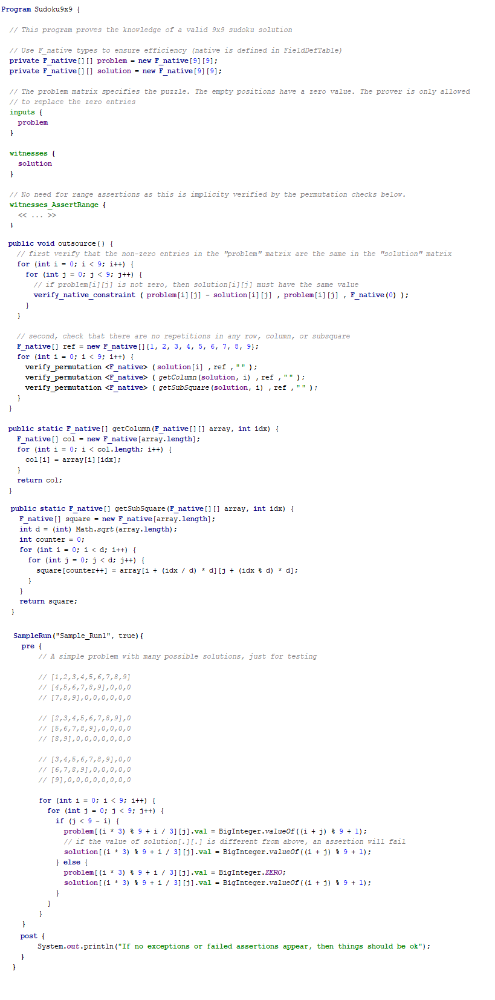
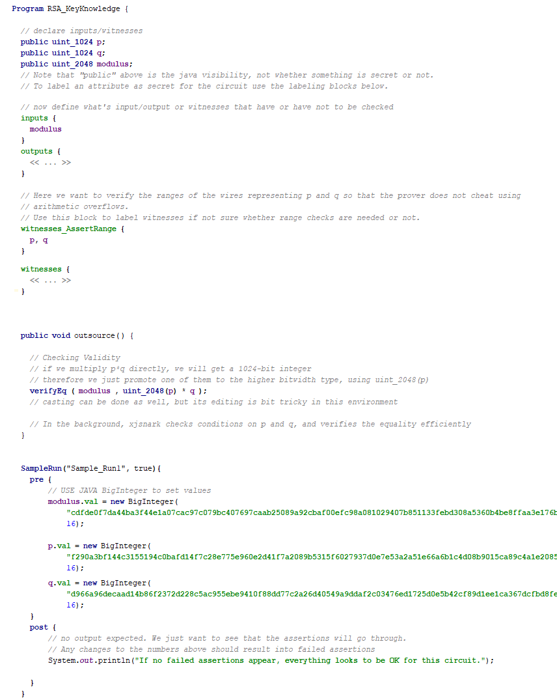
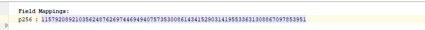
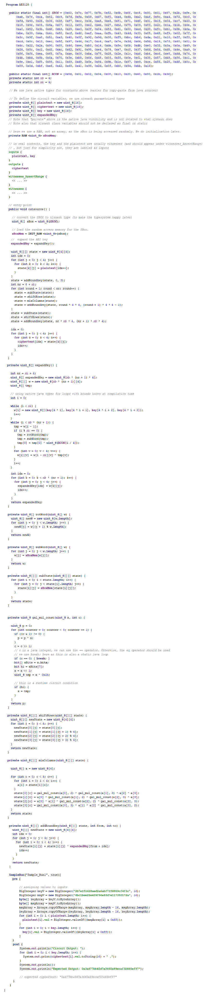
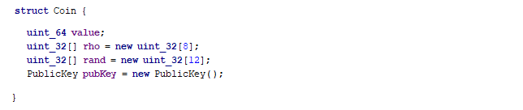
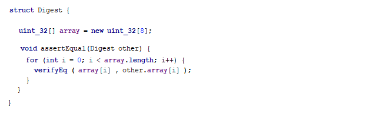
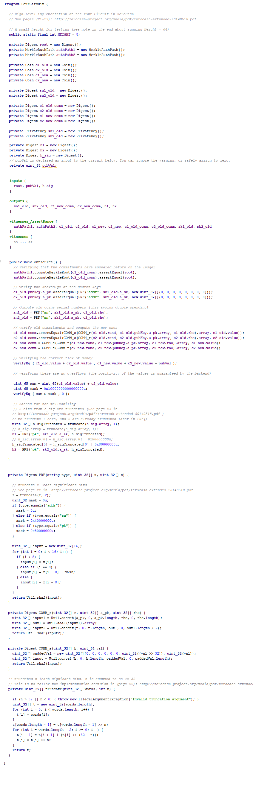

# Code Previews

This file includes snapshots from the examples currently implemented in the framework.
- [Sudoku 9x9](https://github.com/akosba/xjsnark/tree/master/code_previews#sudoku-9x9)
- [SHA-256 (Unpadded)](https://github.com/akosba/xjsnark/blob/master/code_previews/readme.md#sha-256-unpadded
)
- [RSA Secret Key Knowledge](https://github.com/akosba/xjsnark/blob/master/code_previews/readme.md#rsa-secret-key-knowledge
)
- [EC Secret Key Knowledge](https://github.com/akosba/xjsnark/blob/master/code_previews/readme.md#ec-secret-key-knowledge
)
- [AES 128](https://github.com/akosba/xjsnark/blob/master/code_previews/readme.md#aes-128
)
- [Sorting](https://github.com/akosba/xjsnark/blob/master/code_previews/readme.md#sorting
)
- [ZeroCash Pour Circuit](https://github.com/akosba/xjsnark/blob/master/code_previews/readme.md#zerocash-pour-circuit
)

## Sudoku 9x9

## SHA-256 (Unpadded)

## RSA Secret Key Knowledge

## EC Secret Key Knowledge
### Field Definition

### EC Secret Key Knowledge Circuit

## AES 128

## Sorting

## ZeroCash Pour Circuit
### Helper Classes
#### Coin Information

#### Merkle Authentication Path

#### Keys

#### Digest

### Pour Circuit

